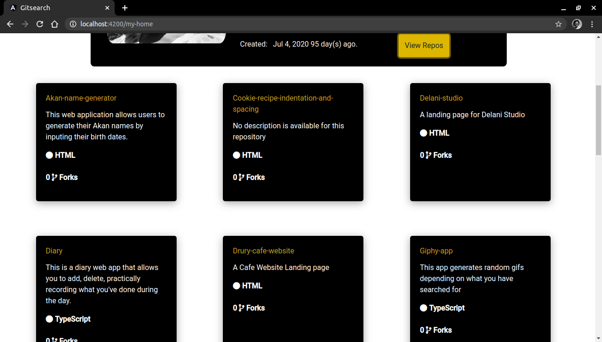

# Github
#### A github finder that allows people to find github users by their username and one gets to view their repositories, 8/10/2020
#### By Felista Kiriinya

## Description
On the application's landing page we have my profile where you can click on the view repos button to view my repositorie.  One can search for any github user they want using the user input on the navigation bar. The search results then display relevant information on the Github user and Github repository respectively.

## Live link

Visit the application on https://felkiriinya.github.io/GitSearch/my-home

## Figma

This is the link to my [figma](https://www.figma.com/file/m36X3UT7Ro0KUf60YJnI70/Untitled?node-id=0%3A1) design

## Development

#### Development server

Run `ng serve` for a dev server. Navigate to `http://localhost:4200/`. The app will automatically reload if you change any of the source files.

#### Code scaffolding

Run `ng generate component component-name` to generate a new component. You can also use `ng generate directive|pipe|service|class|guard|interface|enum|module`.

#### Build

Run `ng build` to build the project. The build artifacts will be stored in the `dist/` directory. Use the `--prod` flag for a production build.

#### Running unit tests

Run `ng test` to execute the unit tests via [Karma](https://karma-runner.github.io).

#### Running end-to-end tests

Run `ng e2e` to execute the end-to-end tests via [Protractor](http://www.protractortest.org/).

#### Further help

To get more help on the Angular CLI use `ng help` or go check out the [Angular CLI README](https://github.com/angular/angular-cli/blob/master/README.md).

## Making Modifications
To make advancements/modifications, follow these steps:

- Fork the repository
- Create a new branch (`git checkout -b improve-feature`)
- Make the appropriate changes in the files
- Add changes made
- Commit your changes (`git commit -am 'Improve feature'`)
- Push to the branch (`git push origin improve-feature`)
- Create a Pull Request 

## Technologies used
This project was generated with [Angular CLI](https://github.com/angular/angular-cli) version 10.1.1.
The technologies used Html,Css,Typescript and Bootstrap

## Support and Contact Details
Should you have any feedback,questions or recommendations, feel free to email me at [felkiriinya@gmail.com](mailto:felkiriinya@gmail.com)

## [License](https://github.com/felkiriinya/GitSearch/blob/master/LICENSE)

Copyright (c) 2020 [Felista Kiriinya](https://github.com/felkiriinya)
